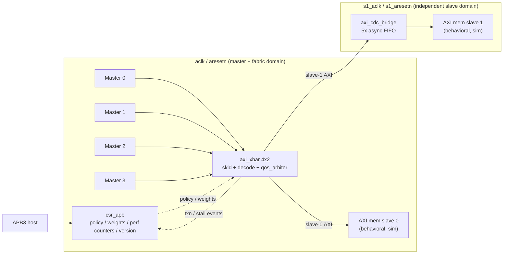
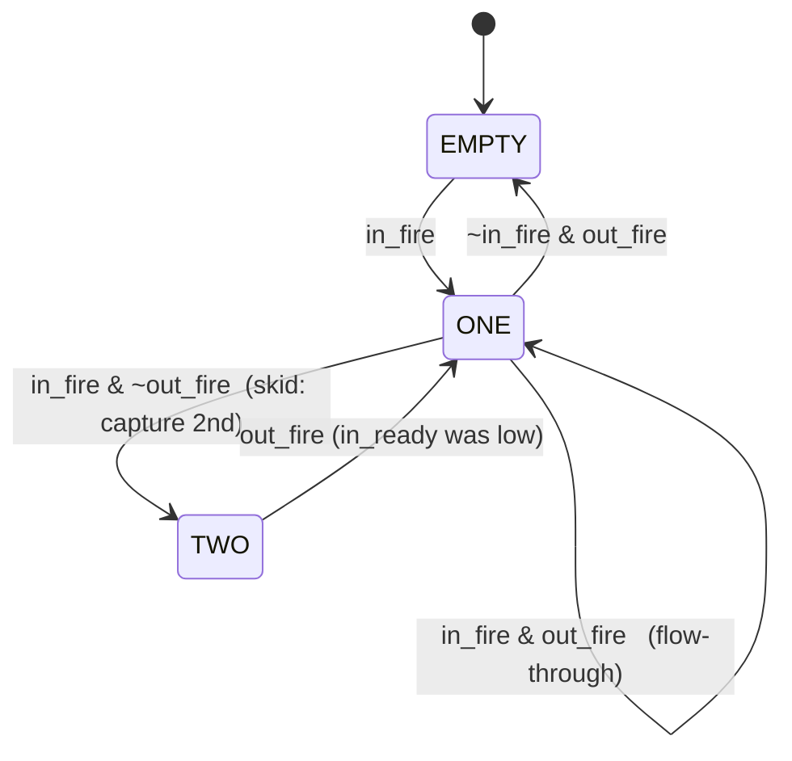
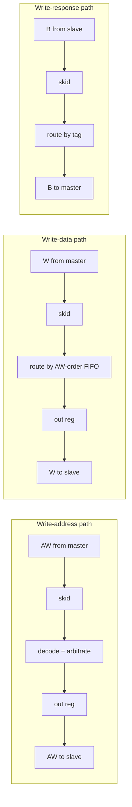
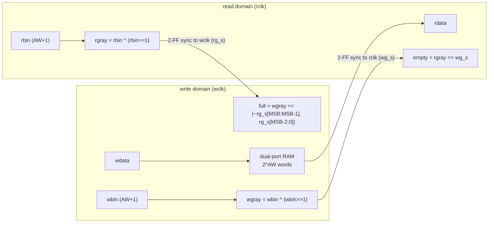
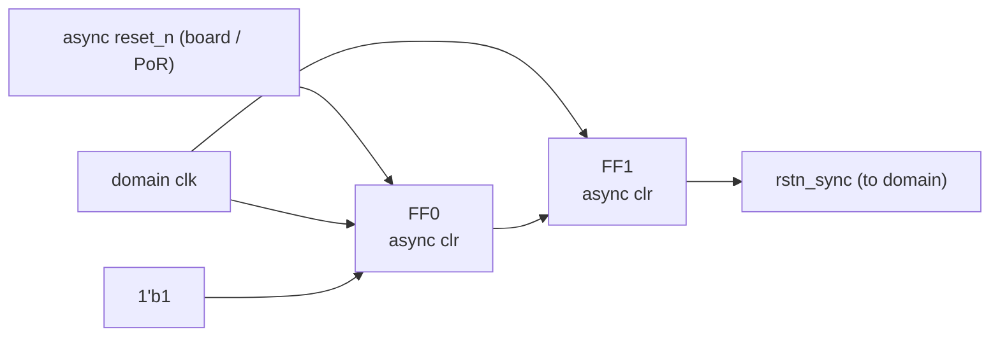

# `axi-qos-fabric` — Microarchitecture Specification

**Project:** parameterizable AXI4 interconnect with QoS-aware arbitration and a
clock-domain-crossing slave port.
**Status:** M0 (design spec, pre-RTL).
**Audience:** RTL designers, DV engineers, synthesis/STA engineers, integrators.
**Convention:** this document is normative for RTL. Where a value is to be
calibrated from measurement (synthesis/STA), it is marked **`TBD-from-data`** —
no performance number in this repo is invented.

---

## 0. Document control

| Item | Value |
|---|---|
| Spec version | 0.1 (M0) |
| Top module | `fabric_top` |
| Default config | 4 masters × 2 slaves, `ADDR_W=32`, `DATA_W=64`, `ID_W=4` |
| Clock domains | 2 (`aclk`, `s1_aclk`) + APB on `aclk` |
| Reset style | active-low, **async assert / sync de-assert** |
| Coding standard | Synthesizable SystemVerilog-2017, `always_ff`/`always_comb` only |

### 0.1 Glossary

| Term | Meaning |
|---|---|
| Master / Slave | AXI manager / subordinate (AXI4 terminology: M=manager, S=subordinate). This doc uses master/slave for brevity. |
| Channel | One of the five AXI channels: AW, W, B, AR, R. |
| Skid buffer | 2-entry registered handshake buffer that breaks the valid/ready combinational path while sustaining 1 transfer/cycle. |
| Outstanding | A transaction whose address has been accepted but whose final response (B / RLAST) has not yet returned. |
| CDC | Clock-domain crossing. |
| QoS | Quality of Service; here driven by the AXI `AxQOS[3:0]` field and/or CSR weights. |
| WRR | Weighted round-robin arbitration. |
| DECERR / SLVERR / OKAY | AXI response codes on `xRESP`. |

### 0.2 References (read-only, clean-room)

- AMBA AXI and ACE Protocol Specification (ARM IHI 0022) — AXI4 channel and
  handshake semantics. **Spec read only; no third-party RTL referenced or copied.**
- AMBA APB Protocol Specification (ARM IHI 0024) — APB3 transfer model.
- Standard dual-clock Gray-code FIFO technique (textbook digital design). The
  async FIFO here is implemented from scratch; see §8 for the derivation.

> **Clean-room statement.** Every module in this repo is written from the
> protocol specifications and first principles. No open-source interconnect
> (e.g. pulp-platform/axi) RTL is vendored or paraphrased. The author can defend
> every line.

---

## 1. Overview & feature list

`axi-qos-fabric` is a synthesizable AXI4 crossbar that connects `N` masters to
`M` slaves, arbitrates contention with a runtime-selectable QoS policy, exposes
performance counters and arbiter configuration over APB3, and places one slave
port behind an asynchronous clock-domain-crossing bridge so it can run on an
independent clock.

### 1.1 Feature table

| # | Feature | In scope | Notes |
|---|---|:---:|---|
| F1 | N×M AXI4 crossbar, independent R/W channels | ✅ | Default 4×2; parameterized. |
| F2 | Per-channel 2-entry skid buffers | ✅ | Full-throughput, registered I/O option. |
| F3 | Strict AXI valid/ready handshake, no combinational loops | ✅ | Enforced by SVA (§12). |
| F4 | Configurable address-map decode, **DECERR on unmapped holes** | ✅ | Compile-time region table. |
| F5 | Outstanding-transaction tracking, **ID-based response routing** | ✅ | Tag = `{master_idx, AxID}` (§6). |
| F6 | QoS arbiter: fixed-priority / round-robin / **weighted-RR off `AxQOS`** | ✅ | Policy & weights via CSR (§7). |
| F7 | **Starvation-free** RR / WRR | ✅ | Proven by directed TB + fairness counter (§7, §12). |
| F8 | Async-FIFO CDC bridge on slave port 1 | ✅ | Gray pointers, 2-FF sync, param depth (§8). |
| F9 | APB3 CSR block: policy, weights, perf counters, version | ✅ | Full map in §10. |
| F10 | Behavioral AXI memory-slave model for sim | ✅ | TB only, not synthesized into the DUT. |
| F11 | INCR and FIXED bursts | ✅ | |
| F12 | WRAP bursts | ❌ | **Non-goal** (wrap-boundary math in decode); revisit post-M4. |
| F13 | Exclusive access / atomics (`AxLOCK`, ACE) | ❌ | **Non-goal**; large DV tax, irrelevant to QoS showcase. |
| F14 | AXI4 narrow-transfer / unaligned support | ✅ | Pass-through; slave model honors `WSTRB`. |
| F15 | Full out-of-order / same-ID reordering | ❌ | **Documented simplification**, see §1.2 and §6.4. |

### 1.2 Non-goals and stated simplifications

These are deliberate. Each is defended where it lives in the spec.

1. **One outstanding transaction per `(master, ID)` pair** (§6.4). Guarantees
   AXI4 same-ID ordering without a reorder buffer. 4-master concurrency to a
   shared slave is **fully preserved** — only a single master reusing one ID
   across slaves is serialized.
2. **WRAP bursts deferred** (F12). INCR covers cache-line-style traffic for the
   benchmark; WRAP adds decode complexity without exercising new fabric paths.
3. **No exclusive/atomic access** (F13).
4. **Behavioral memory slave is simulation-only** — never in the synthesized DUT.

---

## 2. Top-level architecture (`fabric_top`)

### 2.1 Module inventory

| Module | Function | Clock | Reset | File (M1+) |
|---|---|---|---|---|
| `fabric_top` | Integration + sim slave models | both | both | `rtl/fabric_top.sv` |
| `axi_xbar` | N×M crossbar, decode, route, outstanding tracking | `aclk` | `aresetn` | `rtl/axi_xbar.sv` |
| `qos_arbiter` | Per-slave-port grant: fixed / RR / WRR | `aclk` | `aresetn` | `rtl/qos_arbiter.sv` |
| `axi_skid_buffer` | 2-entry handshake buffer (generic payload) | param | param | `rtl/axi_skid_buffer.sv` |
| `axi_cdc_bridge` | 5× async-FIFO AXI crossing for slave 1 | `aclk`+`s1_aclk` | both | `rtl/axi_cdc_bridge.sv` |
| `async_fifo` | Gray-pointer dual-clock FIFO | dual | dual | `rtl/async_fifo.sv` |
| `cdc_sync_2ff` | 2-FF synchronizer (single-bit / bus-of-Gray) | dest | dest | `rtl/cdc_sync_2ff.sv` |
| `reset_sync` | Async-assert / sync-deassert reset synchronizer | dest | raw | `rtl/reset_sync.sv` |
| `csr_apb` | APB3 register file + perf counters | `aclk` | `aresetn` | `rtl/csr_apb.sv` |
| `axi_mem_slave` | Behavioral AXI memory (sim only) | param | param | `tb/axi_mem_slave.sv` |

### 2.2 Dataflow narrative (one read)

1. Master *m* drives `AR` → input **skid buffer** registers it.
2. **Decode** maps `ARADDR` to a slave index `s` (or flags `DECERR` for a hole).
3. **`qos_arbiter[s]`** selects one requesting master per cycle (policy from CSR).
4. On grant, the address is forwarded to slave *s* with tag `{m, ARID}`; the
   per-`(m,ID)` **outstanding scoreboard** is marked busy.
5. Slave returns `R` beats echoing the tag; the **response router** uses the
   `master_idx` field to steer beats back to master *m*, restores `ARID`, and on
   `RLAST` clears the scoreboard entry.
6. If slave *s* is slave 1, every channel traverses the **`axi_cdc_bridge`** in
   the appropriate direction (AW/W/AR fast→slow, B/R slow→fast).

Writes are analogous (AW → arbitrate → forward; W follows in AW-accept order per
slave; B routed by tag).

---

## 3. Parameterization & elaboration contract

### 3.1 Parameters

| Parameter | Default | Legal range | Meaning |
|---|---:|---|---|
| `N_MASTERS` | 4 | 1..16 | Number of master ports. |
| `N_SLAVES` | 2 | 1..16 | Number of slave ports. |
| `ADDR_W` | 32 | 16..64 | AXI address width. |
| `DATA_W` | 64 | 32, 64, 128 | AXI data width (byte-multiple). |
| `ID_W` | 4 | 1..8 | Incoming AXI ID width per master. |
| `USER_W` | 0 | 0..16 | `AxUSER`/`xUSER` width (0 = absent). |
| `MAX_BURST_LEN` | 256 | 1..256 | Max `AxLEN`+1 supported. |
| `CDC_DEPTH` | 8 | pow2 ≥ 4 | Async-FIFO depth per channel (entries). |
| `REG_OUTPUT` | 1 | 0/1 | Register slave-side outputs (timing vs latency). |
| `ARB_POLICY_RST` | 1 (RR) | 0/1/2 | Reset-default policy per slave. |

Derived: `MIDX_W = $clog2(N_MASTERS)`, internal routed ID width
`RID_W = ID_W + MIDX_W`, `STRB_W = DATA_W/8`, `LEN_W = $clog2(MAX_BURST_LEN)`.

### 3.2 Elaboration-time assertions (each is an `$error` in an `initial`/`generate`)

- `DATA_W inside {32,64,128}` and `DATA_W % 8 == 0`.
- `N_MASTERS >= 1 && N_SLAVES >= 1`.
- `CDC_DEPTH` is a power of two and `>= 4`.
- `ID_W >= 1`; `RID_W <= 16` (routing tag must fit echoed ID).
- Address-map regions (§4) are non-overlapping and base-aligned to size.
- `MAX_BURST_LEN inside {1..256}`.

> Rationale: catching illegal configs at elaboration (not simulation) is part of
> "synthesis/timing clean, fully verified" — a misconfigured parameter must fail
> loudly at build time.

---

## 4. Address map & decode

The address map is a compile-time table (package `axi_qos_pkg`), one row per
slave region. Default map (4 GiB space, `ADDR_W=32`):

| Slave | Base | Size | End (excl.) | Attributes |
|---|---|---|---|---|
| S0 | `0x0000_0000` | 256 MiB | `0x1000_0000` | on-chip, `aclk` |
| S1 | `0x1000_0000` | 256 MiB | `0x2000_0000` | CDC, `s1_aclk` |
| — (hole) | `0x2000_0000` | rest | `0x1_0000_0000` | unmapped → **DECERR** |

### 4.1 Decode rules

- A request matches slave *s* iff `base[s] <= AxADDR < base[s] + size[s]`.
- **Exactly one** region may match (overlap is an elaboration error, §3.2).
- **No match → DECERR**: the request is *not* forwarded to any slave. Instead an
  internal **error responder** sinks the address handshake and returns a fully
  formed response with `xRESP = DECERR`:
  - Read: returns `AxLEN+1` `R` beats with `RDATA = 0`, `RRESP = DECERR`,
    `RLAST` on the final beat (AXI requires the full burst length).
  - Write: sinks the entire `W` burst (until `WLAST`), then returns one `B` beat
    with `BRESP = DECERR`.
- Decode is purely combinational from the registered (post-skid) address bits —
  no second cycle of latency for the common (mapped) case unless `REG_OUTPUT=1`.

> DV note: the error responder is a first-class state machine, not an
> afterthought — an unmapped burst that stalls `W` would deadlock the master.
> See assertion A6 (§12).

---

## 5. AXI channel handling — skid buffers & pipelines

All five AXI channels use the same generic `axi_skid_buffer #(.W(payload_w))`.
A skid buffer is a 2-entry buffer that **registers both `valid`/payload and the
back-pressure path**, so the fabric never creates a long combinational
`ready`→`ready` chain across the crossbar, yet still sustains one transfer per
cycle.

### 5.1 Why skid buffers (not a single register, not a bypass)

- A plain output register breaks the forward path but **stalls** when downstream
  deasserts `ready` (loses a cycle each bubble) — half throughput under
  back-pressure.
- A combinational bypass keeps throughput but **re-couples** `ready`, recreating
  the long path the crossbar is trying to cut.
- A 2-entry skid buffer gives **both**: registered `ready` and full throughput.
  The second entry absorbs the in-flight beat during the cycle `ready` falls.

### 5.2 Skid buffer FSM (2-entry "double buffer")

- `in_ready` is high in `EMPTY` and `ONE`, **low in `TWO`** (full).
- `out_valid` is high in `ONE` and `TWO`.
- `in_fire = in_valid & in_ready`; `out_fire = out_valid & out_ready`.
- Reset → `EMPTY`, `out_valid=0`. No combinational path from `out_ready` to
  `in_ready` (that is the whole point).

### 5.3 Per-channel pipeline (one slave port, `REG_OUTPUT=1`)

(AR/R mirror AW/B.) The **W path is ordered**: AXI4 removed `WID`, so write data
must arrive at a slave in the same order its `AW`s were accepted. A small
per-slave FIFO pushes the granted `master_idx` at each `AW` accept and pops it at
`WLAST`, selecting which master's `W` stream is connected. Writes from different
masters to the same slave therefore **cannot interleave** (correct per AXI4).

### 5.4 Latency / throughput budget (target; actuals in M4)

| Path | Latency (cycles) | Throughput |
|---|---:|---|
| Skid buffer (per hop) | 1 | 1 xfer/cyc |
| Xbar AW→slave AW, `REG_OUTPUT=1`, uncontended | 2 | 1 xfer/cyc |
| Xbar AW→slave AW, `REG_OUTPUT=0` | 1 | 1 xfer/cyc |
| Response B/R back to master | 2 | 1 xfer/cyc |
| CDC crossing (each direction), `CDC_DEPTH=8` | ~3–4 | 1 xfer/cyc (FIFO not empty/full) |

> The CDC latency is **synchronizer + FIFO** and depends on the clock ratio;
> exact min/typ numbers are reported from cocotb in M4 (`TBD-from-data`).

---

## 6. Crossbar microarchitecture (`axi_xbar`)

`axi_xbar` is decode → arbitrate → route, replicated for the read and write
address paths, with independent response routers.

### 6.1 Structure

- **Per master input stage:** skid buffers on AW, W, AR; skid buffers on the
  return B, R.
- **Per slave output stage:** one `qos_arbiter` for AW (write) and one for AR
  (read); output skids (when `REG_OUTPUT=1`); the W-order FIFO (§5.3).
- **Crosspoint:** the granted master's address/data is muxed to the slave.

### 6.2 Request path

1. Decode `AxADDR` → target slave (or DECERR responder).
2. Mask the request into `qos_arbiter[s]`'s request vector only if the
   per-`(m,ID)` scoreboard slot is free (back-pressure for ordering, §6.4).
3. Arbiter raises a one-hot `grant`; the address is forwarded with tag
   `{m, AxID}` and the scoreboard slot is set busy.

### 6.3 Response routing (ID-based)

When a slave returns `B`/`R`, it echoes the tag in `BID`/`RID`. The router:

- Extracts `master_idx = tag[RID_W-1 : ID_W]` → demux target master.
- Restores `AxID = tag[ID_W-1 : 0]` toward the master.
- On `BVALID`/`RLAST` accepted, clears the `(master_idx, AxID)` scoreboard slot.

Because the tag's high bits uniquely identify the owning master, **no CAM and no
content search** is needed on the response path — it is a fixed demux keyed by a
slice of the echoed ID. This is the cheap, clean way to get "ID-based response
routing" the JD asks for.

### 6.4 Outstanding & ordering model — the documented simplification

**Rule:** at most **one outstanding transaction per `(master, ID)` pair** at a
time, fabric-wide. A per-master, per-ID **busy bit** (a `2^ID_W`-bit vector per
master) is set when an address with that ID is forwarded and cleared when its
response completes. A second address with a busy ID is held in the input skid
(its request is masked out of arbitration) until the first completes.

**Why this rule exists.** AXI4 requires that responses to transactions issued
with the **same ID** return **in issue order**. If a master sent two same-ID
reads to two *different* slaves, those slaves could respond in any relative
order, and the fabric would have to **reorder** R beats to honor AXI ordering.
That requires a reorder buffer (storage for early beats) plus per-ID destination
tracking.

**What we do instead.** We forbid the second same-ID issue until the first
completes. Consequences:

- ✅ **Different IDs** from one master proceed concurrently (a master can still
  have many transactions in flight — just not two on the *same* ID).
- ✅ **Different masters** are fully independent → the 4→1 contention benchmark
  (the interesting QoS case) runs at full concurrency.
- ⚠️ A master that streams many transactions on a **single ID** to **different
  slaves** is serialized on that ID.

**Trade-off vs. full reordering.** Full out-of-order support would recover that
last case at the cost of: a reorder buffer per master (area ∝ outstanding-depth ×
`DATA_W`), a per-ID destination-order FIFO, and a large verification surface
(out-of-order injection, ID aliasing, partial-burst reordering). For an
arbitration/QoS/CDC showcase this is a poor trade — the concurrency that
demonstrates the arbiter is between *masters*, which we keep. **This is the kind
of decision the spec exists to record.**

### 6.5 Deadlock-avoidance argument

The fabric is deadlock-free under these structural guarantees:

1. **Channel independence.** AW/W/B and AR/R are separate FIFOs/skids with no
   cross-channel `ready` dependency. A blocked write never gates a read.
2. **No `ready` depends on its own channel's downstream `valid`** within the
   crossbar (skid buffers, not bypasses) → no combinational handshake loop.
3. **W follows AW order per slave** and the W-order FIFO is at least as deep as
   the AW outstanding limit → the W router can always make progress for the
   oldest accepted AW.
4. **DECERR responder always drains** the address (and, for writes, the full W
   burst) and always produces a response → an unmapped access cannot wedge a
   master's W channel.
5. **Bounded outstanding** (§6.4) → the response scoreboard cannot overflow;
   every forwarded transaction has a reserved return slot before it is sent.

These are the points DV must hammer (see assertions A1–A8, §12) and the answers
to "where could this fabric deadlock and what prevents it."

---

## 7. QoS arbiter (`qos_arbiter`)

One instance per slave per direction (AW, AR). Inputs: a request vector (one bit
per master, already masked by decode + scoreboard), the per-master `AxQOS`,
CSR-supplied policy and weights. Output: a **one-hot** `grant` and a `grant_valid`.

### 7.1 Policies (CSR-selected at runtime, per slave)

| `policy` | Name | Behavior |
|:---:|---|---|
| 0 | Fixed priority | Lowest master index wins. Simple; **can starve** high indices — intended for strictly-ranked traffic and used as a baseline. |
| 1 | Round-robin | Rotating priority pointer; every requester served within ≤ `N_MASTERS-1` grants of asserting. **Starvation-free.** |
| 2 | Weighted RR (QoS) | Each master has a weight (CSR or derived from `AxQOS`); served proportionally via a credit scheme, **with a guaranteed floor** so no requester is locked out. **Starvation-free.** |

### 7.2 Round-robin mechanism

A `priority_ptr` (log2 `N_MASTERS` bits) marks the highest-priority master this
cycle. Grant = first asserted request at-or-after `priority_ptr` (mod
`N_MASTERS`), found with a rotate-mask + priority-encoder. On an accepted grant,
`priority_ptr` advances to `granted_idx + 1`. A requester that is passed over is
guaranteed to be at-or-after the pointer within `N_MASTERS-1` grants → **bounded
wait**.

### 7.3 Weighted round-robin (the QoS path)

Each master *m* has `weight[m] ∈ [1, 255]` (CSR `ARB_WEIGHT_*`, optionally
overridden by mapping `AxQOS` → weight). The arbiter maintains a **credit
counter** `credit[m]`:

- At the start of a round (all eligible credits exhausted), `credit[m] ← weight[m]`.
- A master is **eligible** if `request[m] & credit[m] > 0`.
- Among eligible masters, an inner **round-robin** picks one (so equal weights
  degrade to fair RR, not fixed priority).
- On grant, `credit[granted] ← credit[granted] - 1`.
- **Starvation floor:** every weight is `≥ 1`, and a round does not restart until
  all *requesting* masters with credit have been served or dropped their request.
  Thus within one round every continuously-requesting master is served at least
  `weight[m] ≥ 1` times → **bounded wait ≤ Σ weights**.

> WRR gives master *m* a long-run grant share of `weight[m] / Σ weight[k]` over
> active masters, **and** a hard upper bound on wait time. Both properties are
> demonstrated, not asserted: a directed scenario (one greedy high-weight master
> + one minimum-weight master both saturating one slave) plus a **fairness
> counter** in the TB checks the realized ratio against `weight` and checks the
> low-weight master is granted within the bound (§12, test `wrr_starvation`).

### 7.4 Grant legality invariants (bound as SVA, §12)

- `grant` is **one-hot or zero** every cycle (`$onehot0(grant)`).
- `grant_valid == |grant`.
- `grant[m]` implies `request[m]` (never grant a non-requester).
- `grant` is stable while the granted transfer is stalled (no grant-flapping
  mid-handshake).

---

## 8. Clock-domain-crossing bridge (`axi_cdc_bridge`)

Slave port 1 runs on `s1_aclk`, asynchronous to `aclk`. The bridge crosses **all
five AXI channels**, each through its own `async_fifo`:

| Channel | Direction | Producer clk | Consumer clk |
|---|---|---|---|
| AW | request | `aclk` | `s1_aclk` |
| W  | request | `aclk` | `s1_aclk` |
| AR | request | `aclk` | `s1_aclk` |
| B  | response | `s1_aclk` | `aclk` |
| R  | response | `s1_aclk` | `aclk` |

Each channel's payload (e.g. AW = `{ID, ADDR, LEN, SIZE, BURST, QOS, ...}`) is
one FIFO word. AXI `valid`/`ready` map to FIFO `push`/`pop`:
`push = src_valid & ~full`, `src_ready = ~full`; `dst_valid = ~empty`,
`pop = dst_valid & dst_ready`.

### 8.1 `async_fifo` — Gray-pointer dual-clock FIFO

Depth `D = CDC_DEPTH = 2^AW_PTR` entries; pointers are `AW_PTR+1` bits (the extra
MSB distinguishes full from empty).

- **Write side** (in `wclk`): on `push & ~full`, write `wdata` to `mem[wbin[AW-1:0]]`
  and increment `wbin`. `full` compares the local `wgray` against the
  **synchronized** read-Gray pointer.
- **Read side** (in `rclk`): on `pop & ~empty`, increment `rbin`; `rdata` is
  `mem[rbin[AW-1:0]]`. `empty` compares local `rgray` against the
  **synchronized** write-Gray pointer.
- **Only Gray-coded pointers cross domains**, each through a 2-FF synchronizer.
  The RAM itself is written in one domain and read in the other but never has a
  pointer race because the producing pointer is only *observed* in the other
  domain after synchronization (data is guaranteed stable: it was written ≥ 2
  destination edges before its pointer is seen).

### 8.2 Why Gray code

A binary pointer can have **multiple bits change simultaneously**. Sampling a
multi-bit binary value with a synchronizer at an async edge can capture an
arbitrary mix of old/new bits → a **wildly wrong count** → false full/empty →
data corruption. Gray code changes **exactly one bit per increment**, so a
metastable sample resolves to either the old or the new value — off by at most
one position, which is **always safe** (it can only make the FIFO look *more*
full to the writer or *more* empty to the reader, never the dangerous reverse).

### 8.3 Why 2-FF synchronizers (and what they cost)

Two flops in the destination clock give the first flop's metastability a full
destination clock period to resolve before the value is used (raising MTBF to
effectively infinite for these clocks). Cost: **+2 destination cycles of
latency** per crossing and a constraint that the source signal is stable
multi-cycle (true for Gray pointers: one bit changes, then holds). These flops
must be marked for STA (`set_false_path`/`set_clock_groups -asynchronous`, §9.3)
and ideally tagged `ASYNC_REG`-style; they are **the only** sanctioned crossing.

### 8.4 CDC reset

Each domain resets its own FIFO pointers via that domain's `reset_sync` (§9). A
common async reset source feeds both; de-assertion is independently synchronized
per domain so neither side releases reset into a running clock metastably.
Pointers reset to 0 (Gray 0) → FIFO comes up empty in both domains.

---

## 9. Reset & clocking plan

### 9.1 Reset strategy: async assert / sync de-assert

All resets are **active-low** (`aresetn`, AXI convention). For each clock domain
a `reset_sync` produces a local `rstn_sync`:

- **Assertion is asynchronous:** when `raw` goes low, both flops clear
  immediately (async clear) → logic is held in reset even with no running clock.
- **De-assertion is synchronous:** when `raw` releases, the `1'b1` walks through
  FF0→FF1 on the domain clock, so `rstn_sync` rises **aligned to the clock**,
  never violating recovery/removal on the destination flops.

Every flop in the design has a defined reset (or a documented exemption — e.g.
FIFO *data* RAM is not reset, only pointers are; data validity is governed by the
pointers). This is the "every flop has defined reset behavior or a documented
exemption" rule.

### 9.2 Clock domains

| Clock | Drives | Relationship | Target Fmax |
|---|---|---|---|
| `aclk` | masters, xbar, arbiters, CSR, slave 0 | reference | **`TBD-from-data`** (aspiration: maximize on sky130_hd) |
| `s1_aclk` | slave 1 + read side of CDC | **asynchronous** to `aclk` | **`TBD-from-data`** |

CSR/APB share `aclk` (APB is low-frequency control; no separate `pclk` needed).
Both Fmax targets are set from the **first** M3 synthesis result, then iterated
(M3 logs every iteration: critical path → change → area cost).

### 9.3 Constraints implied for STA (M3 SDC)

- `create_clock` on `aclk` and `s1_aclk` (independent).
- `set_clock_groups -asynchronous` between `aclk` and `s1_aclk` (the only legal
  crossings are the Gray pointers through 2-FF syncs).
- Input/output delays on AXI/APB boundary ports.
- (Optional) `set_max_delay -datapath_only` on the synchronizer source→first-FF
  if the synthesis library models it; otherwise the async clock group covers it.

---

## 10. CSR block (`csr_apb`)

APB3 slave on `aclk`. Standard APB3 transfer: `PSEL` then `PSEL&PENABLE` (access
phase), `PREADY` completes, `PSLVERR` on bad access (e.g. write to RO, or
unmapped offset). One register per 4-byte word; little-endian.

### 10.1 Register map (base = APB region base)

| Offset | Name | Access | Reset | Fields |
|---|---|:---:|---|---|
| `0x00` | `VERSION` | RO | `0x0051_0100` | `[31:16]`=magic `0x0051`("Q!"), `[15:8]`=major=1, `[7:0]`=minor=0 |
| `0x04` | `SCRATCH` | RW | `0x0000_0000` | free R/W (connectivity sanity) |
| `0x08` | `ARB_POLICY` | RW | per `ARB_POLICY_RST` | `[1:0]`=slave0 policy, `[9:8]`=slave1 policy (0=fixed,1=RR,2=WRR) |
| `0x10` | `ARB_WEIGHT_S0` | RW | `0x0101_0101` | `[7:0]`=w(M0) … `[31:24]`=w(M3) for slave 0 |
| `0x14` | `ARB_WEIGHT_S1` | RW | `0x0101_0101` | weights for slave 1 |
| `0x18` | `PERF_CTRL` | RW | `0x0` | `[0]`=clear_all (self-clear), `[1]`=freeze, `[2]`=qos_override (use AxQOS as weight) |
| `0x20`–`0x2C` | `PERF_TXN_M0..M3` | RO | `0x0` | completed transactions per master (saturating) |
| `0x30`–`0x3C` | `PERF_STALL_M0..M3` | RO | `0x0` | stall cycles per master (request asserted, not granted; saturating) |
| `0x40` | `PERF_CYCLES` | RO | `0x0` | free-running cycle count since last clear (denominator for utilization) |
| `0x44` | `STATUS` | RO | — | `[N_SLAVES-1:0]` CDC-FIFO-not-empty, arbiter activity snapshot |

- Unmapped offset → `PSLVERR`. Write to RO → `PSLVERR`, no state change.
- Weights are clamped to `≥ 1` on write (a 0 weight would violate the starvation
  floor, §7.3); writing 0 reads back as 1.

### 10.2 Performance counters (observability)

| Counter | Tap point | Width | Overflow |
|---|---|---:|---|
| `PERF_TXN_Mx` | increment on each accepted `B` or `RLAST` owned by master x | 32 | **saturate** (no wrap; cleared via `PERF_CTRL.clear_all`) |
| `PERF_STALL_Mx` | increment per cycle master x asserts an address `valid` but is not granted | 32 | saturate |
| `PERF_CYCLES` | free-running while `~freeze` | 32 | saturate |

`clear_all` resets all perf counters synchronously and self-clears. `freeze`
stops all counters (for glitch-free readback). These feed the M4 results table
(throughput, stall %, fairness) — **measured, from RTL, not hand-waved**.

---

## 11. Performance counters & observability (summary)

The counters in §10.2 plus the arbiter's internal fairness/credit state are the
fabric's self-measurement. The M2 cocotb scoreboard cross-checks TXN counts
against issued/observed transactions; M4 reads STALL/CYCLES to report utilization
and the WRR realized-share ratio. Counter readback is via APB (so a real SoC's
firmware could read them too — the "documentation/telemetry other teams consume"
the JD asks for).

---

## 12. Verification hooks (for the DV team)

### 12.1 What DV binds to

- Each AXI channel is exposed as a SystemVerilog `interface` (`axi4_if`) with a
  `clocking` block; SVA modules are **bound** to these interfaces (no DUT edits).
- The arbiter exposes `request`, `grant`, `grant_valid` for grant-legality SVA.
- Each `async_fifo` exposes `full`, `empty`, `push`, `pop` for over/underflow SVA.

### 12.2 Assertion inventory (SVA)

| ID | Property | Where |
|---|---|---|
| A1 | `valid` held stable until `ready` (no withdrawal mid-handshake) | every AXI channel |
| A2 | payload stable while `valid && !ready` | every AXI channel |
| A3 | no `X` on `valid`/`ready`/payload when `valid` | every AXI channel |
| A4 | `$onehot0(grant)` and `grant ⊆ request` | each arbiter |
| A5 | grant stable while granted transfer stalled | each arbiter |
| A6 | DECERR responder returns exactly `AxLEN+1` R beats / one B beat | error responder |
| A7 | async FIFO never `push & full`, never `pop & empty` | each FIFO |
| A8 | `RLAST`/`BVALID` only for an outstanding `(master,ID)` (no orphan response) | response router |
| A9 | per-`(master,ID)` outstanding count ≤ 1 (the §6.4 rule holds) | scoreboard |
| A10 | WRR: low-weight requester granted within Σweights cycles of continuous request | arbiter (bound) |

### 12.3 Coverage (cocotb / functional)

- Cross of {policy} × {contending master count 1..4} × {burst len short/long} ×
  {INCR,FIXED} × {target slave 0/1}.
- CDC: FIFO occupancy hits 0, 1, mid, `DEPTH-1`, `DEPTH` (full) on both clock
  ratios (slow→fast and fast→slow).
- DECERR: every master hits the unmapped hole on read and write.

### 12.4 Scoreboard expectations

- **Data integrity:** every read returns the last data written to that address
  (per-master reference memory model; honors `WSTRB`).
- **Response routing:** every `B`/`R` returns to the issuing master with the
  original `AxID`.
- **No loss / no dup:** issued transaction count == completed count per master
  (cross-checked against `PERF_TXN_Mx`).
- **Ordering:** same-ID responses to a master are in issue order (A9 guarantees
  the simplification that makes this hold).

### 12.5 Regression

cocotb + Verilator, constrained-random traffic from all masters, **seed sweep in
CI** (GitHub Actions: `make lint` + multi-seed `make test` on every push).

---

## 13. PPA goals

All performance numbers are **`TBD-from-data`** — seeded from the first M3
synthesis/STA run, then iterated. This section defines *what* we report, not
invented values.

| Metric | Domain | Target | Source |
|---|---|---|---|
| Fmax | `aclk` | maximize, set target after run 1 | OpenSTA `report_checks` |
| Fmax | `s1_aclk` | independent target | OpenSTA |
| Cell area | full DUT | report + per-module breakdown | Yosys `stat` (sky130_fd_sc_hd) |
| Throughput | 4→1 contention | ≈ 1 beat/cyc at the slave, shared per policy | cocotb + `PERF_*` |
| WRR realized share | per master | within ±X% of `weight/Σweight` | TB fairness counter |
| Latency | AW→B, AR→first R | min / typ, per slave (slave 1 includes CDC) | cocotb timestamps |

M3 logs each iteration as: *critical path → change made → area delta → Fmax delta*.
M4 fills this table with measured numbers and the 3 resume bullets.

---

## 14. Open questions & risks

| # | Question / risk | Resolution plan |
|---|---|---|
| Q1 | Outstanding depth beyond 1-per-ID — do we want a small per-ID-distinct depth for higher single-master throughput? | Revisit after M2 throughput numbers; spec'd as fixed at 1 for now (§6.4). |
| Q2 | WRR weight source: CSR only, `AxQOS` only, or `max/select`? | `PERF_CTRL.qos_override` selects; default CSR. Validate in M2. |
| Q3 | CDC FIFO depth vs. AXI burst length — shallow FIFO + long burst can throttle. | `CDC_DEPTH` default 8; sweep in M2, document throughput vs depth. |
| Q4 | Behavioral slave latency model — fixed vs. random ready stalls. | Random-stall mode in TB to stress skid/arbiter; default deterministic. |
| Q5 | sky130 has no hard RAM here — async FIFO RAM maps to flops; area cost. | Accept for portfolio; note in M4 that a real flow would use a 2-port macro. |

---

*End of M0 spec. RTL (M1) is written against this document; any deviation is a
spec change recorded here with rationale.*
